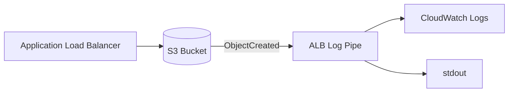

# ALB Log Pipe

Process and deliver your AWS Application Load Balancer access logs anywhere.



## Overview

ALBs store access logs as gzip-compressed files in S3. ALB Log Pipe runs as a Lambda function that automatically processes new log files and forwards them to CloudWatch Logs or other targets.

## Installation

### As CLI tool

```bash
go install github.com/jdwit/alb-log-pipe@latest
```

### As Lambda function

```bash
# Build the Lambda package
make build-lambda

# Upload lambda.zip to AWS Lambda with:
# - Runtime: Amazon Linux 2023 (provided.al2023)
# - Handler: bootstrap
# - Trigger: S3 ObjectCreated events on your ALB logs bucket
```

## Configuration

Environment variables:

| Variable | Description | Required |
|----------|-------------|----------|
| `TARGETS` | Comma-separated targets: `cloudwatch`, `stdout` | Yes |
| `CLOUDWATCH_LOG_GROUP` | CloudWatch Log Group name | If cloudwatch target |
| `CLOUDWATCH_LOG_STREAM` | CloudWatch Log Stream name | If cloudwatch target |
| `FIELDS` | Comma-separated fields to include (empty = all) | No |

### Available Fields

All 30 ALB log fields are supported. See [ALB access log entries](https://docs.aws.amazon.com/elasticloadbalancing/latest/application/load-balancer-access-logs.html#access-log-entry-format) for the full list.

Common fields: `type`, `time`, `elb`, `client:port`, `target:port`, `request_processing_time`, `target_processing_time`, `response_processing_time`, `elb_status_code`, `target_status_code`, `request`, `user_agent`

## CLI Usage

Process existing logs from the command line:

```bash
TARGETS=stdout \
./alb-log-pipe s3://my-bucket/AWSLogs/123456789/elasticloadbalancing/us-east-1/2024/01/01/
```

With CloudWatch and field filtering:

```bash
TARGETS=cloudwatch \
CLOUDWATCH_LOG_GROUP=/alb/access-logs \
CLOUDWATCH_LOG_STREAM=production \
FIELDS=request,elb_status_code,target_processing_time \
./alb-log-pipe s3://my-bucket/AWSLogs/123456789/elasticloadbalancing/us-east-1/2024/01/01/
```

## Development

```bash
# Build
make build

# Run tests
make test

# Format code
make fmt
```

## License

MIT
